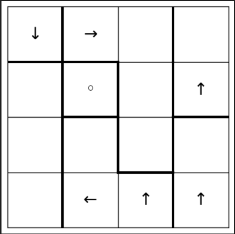
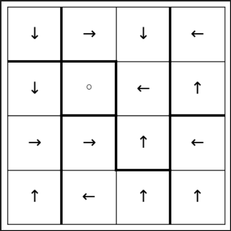

Voici le `README.md` en anglais avec les modifications demandées :

# Roma Puzzle Solver Project 🏛️

Welcome to the Roma Puzzle Solver project! This project aims to provide an efficient method for solving Roma puzzles, a fascinating puzzle game that combines logic, constraints, and graph theory. Whether you're a puzzle enthusiast or interested in algorithmic complexity problems, this solver will help you tackle increasingly challenging grids. 🔍

<!-- Images side by side -->
<table>
  <tr>
    <td></td>
    <td></td>
  </tr>
</table>

## What is the Roma Puzzle? 🤔

The Roma puzzle is played on an n × n grid, where each cell can contain an arrow pointing in one of the four cardinal directions: **↑, →, ↓, ←**. The goal is to fill the empty cells with arrows while adhering to several strict rules:

- **Roma Cell**: One special cell, called the "Roma cell" (denoted by **◦**), must be reachable from any other cell by following the arrows.
- **Boxes**: The grid is divided into small groups of adjacent cells called "boxes". Each box can only contain one arrow pointing in each direction.
- **Preset Arrows**: Some cells may already have arrows at the start of the puzzle, and these arrows must remain unchanged in the solution.

### The Challenge:

Although simple at first glance, the Roma puzzle presents significant algorithmic complexity, as demonstrated by our detailed analysis. Solving the puzzle involves exploring numerous possible arrow configurations while avoiding cycles in the directed graph formed by the arrows.

## Solving the Roma Puzzle 🧠

In this project, we employ advanced techniques to automatically solve Roma puzzle instances. Here are some of the key constraints we must enforce:

1. **Arrow Validity**: 
   - Each arrow must point in a direction that leads to other cells while respecting the box rules.
   
2. **No Cycles**:
   - The arrows must not form cycles. This means no circular paths should exist that lead back to the starting point without passing through the Roma cell.
   
3. **Respect for Preset Arrows**:
   - Any arrows already present in the grid at the start must remain unchanged and be integrated into the final solution.

4. **Unique Direction per Box**:
   - Each box on the grid can only contain one arrow pointing in each direction (for example, only one arrow pointing up per box).

### Why is solving a Roma Puzzle hard? 
Solving a Roma puzzle is an **NP-complete problem**, meaning the complexity of the problem increases rapidly as the grid size grows. This makes it a great subject of study for those interested in graph theory, dynamic programming, and algorithmic complexity challenges.

## Project Features ⚙️

- Automatic solving of Roma puzzles with advanced constraints.
- Handling of predefined arrows and complex configurations.
- Backtracking algorithm to explore different potential solutions.
- Validation of solutions via a directed graph, ensuring no cycles and compliance with all the puzzle rules.

## Example Usage 📜

Here is an example of a simple Roma puzzle instance on a 4x4 grid:

```python
n = 4
roma_cell = (1, 1)
arrows = {
    (0, 0): '↓', (0, 1): '→', (1, 3): '↑', (3, 1): '←', (3, 2): '↑', (3, 3): '↑'
}
boxes = {
    (0, 0): 1, (1, 0): 2, (2, 0): 2, (3, 0): 2,
    (0, 1): 3, (0, 2): 3, (1, 2): 3, (2, 2): 3,
    (0, 3): 4, (1, 3): 4, (2, 3): 5, (3, 3): 5,
    (3, 2): 6, (3, 1): 6, (2, 1): 6, (1, 1): 7
}
```

This project can also solve larger and more complex puzzles!

## Complexity Analysis 🚀

For a deeper understanding of the algorithmic complexity of the Roma puzzle, a detailed article is available in the **resources** folder. This article, which I authored, explores the computational complexity of the problem, based on the research of Kevin Goergen, Henning Fernau, Esther Oest, and Petra Wolf. Key results include:

- **NP-completeness**: Proving that solving a Roma puzzle is an NP-complete problem.
- **#P-completeness**: Showing that counting the number of valid solutions for a Roma puzzle is a #P-complete problem.
- **Execution time**: Under the Exponential Time Hypothesis (ETH), it is shown that solving a Roma instance on an n × n grid cannot be done in O(2^o(n)) time.

For more details, you can read the full analysis in the article written in ressources.

### Abstract of the article:

*This paper provides an analysis of the research article "All roads lead to Rome" by Kevin Goergen, Henning Fernau, Esther Oest, and Petra Wolf, which investigates the computational complexity of the puzzle game Roma. Played on an n×n grid of quadratic cells grouped into boxes of up to four adjacent cells, Roma challenges players to fill empty cells with arrows pointing in cardinal directions. The objective is to ensure that each box contains at most one arrow of each direction, and that following the arrows from any starting point always leads to a special Roma cell. This report delves into these findings, methodologies employed, and highlights the properties and limitations, offering a comprehensive overview of the significant advancements and challenges in the study of computational complexity of puzzle games like Roma.*

## Conclusion 🎉

This Roma Puzzle Solver project combines fascinating aspects of graph theory, dynamic programming, and algorithmic complexity. It also serves as a perfect tool to explore NP-completeness problems. If you're up for an intellectual challenge or would like to contribute to the project, feel free to join us! Happy puzzling! 🧠✨

## References 📚

1. Goergen, K., Fernau, H., Oest, E., & Wolf, P. (2021). "All roads lead to Rome: The computational complexity of Roma puzzles."R